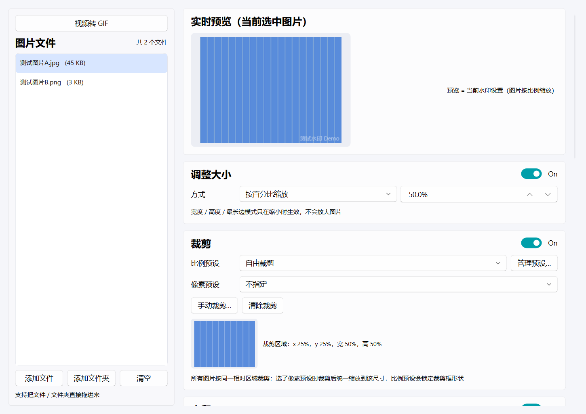

# 图片工具箱

Windows 桌面批量图片处理工具：**压缩、水印、批量重命名、调整大小、手动裁剪、格式互转**，
以及 **视频转 GIF**（自由选片段）。
技术栈：Python + PySide6 + qfluentwidgets（Fluent 界面）+ Pillow + OpenCV。



## 运行

```bash
pip install -r requirements.txt
python main.py                       # 首次启动弹出布局选择框
python main.py --layout collapse    # 也可直接指定：collapse / nav
```

## 快捷启动

- **`启动图片工具箱.bat`**：双击即启动（优先用打包好的 exe，没打包就退回 Python 源码运行），
  支持透传参数，如 `启动图片工具箱.bat --layout nav`
- **`建立桌面快捷方式.bat`**：双击后在桌面创建带图标的"图片工具箱"快捷方式（需先打包 exe）
- 两个脚本均为 GBK 编码（cmd 兼容），改动后需转回 GBK 保存

## 两种界面布局

两种布局共用同一套功能（设置和收集逻辑只有一份），随时可换：
**点左上角"切换布局"按钮**，弹出选择框（会标出当前布局），选定后自动保存并重启到新布局。
也可以用 `--layout` 参数，或删除 `~/.imgtoolbox/layout.txt` 重新弹出选择框。

| 布局 | 特点 | 适合 |
|---|---|---|
| **智能折叠**（collapse） | 单列卡片，未启用的功能折叠成一行，启用即展开；执行栏固定底部 | 喜欢一眼看到所有功能名 |
| **左侧导航**（nav） | 三栏通顶结构：左图片文件 / 中当前功能 / 右实时预览（顶部开关可收起），**栏间可拖动分割条自由调宽**；五个功能 + 视频转 GIF 都在左侧导航，执行栏固定底部 | 更像正式软件的形态 |

单功能使用：打开对应功能/卡片开开关，点"开始处理"。
组合使用：把要用的功能都开开关（如裁剪 + 水印 + 目标体积压缩），一次流水线跑完，
处理顺序固定为 裁剪 → 缩放 → 水印 → 压缩/转格式 → 保存。

## 功能说明

左侧添加文件 / 文件夹（支持拖拽），右侧每个功能用开关启用或停用，
可任意组合（如：缩放 50% + 加水印 + 转 WEBP 一次完成），点"开始处理"。
处理在后台线程进行，不卡界面；结果输出到独立目录，**绝不覆盖原图**。

| 功能 | 说明 |
|---|---|
| 调整大小 | 按百分比 / 指定宽度 / 指定高度 / 限制最长边；只缩小不放大，保持宽高比 |
| 裁剪 | **每张图三选一**：跟随批量 / 单独区域（只对这张生效，各图独立记忆）/ 不裁剪（跳过）；批量框在参考图上画一次全列表生效；比例预设（1:1、16:9 等，可添加）锁定框形状且切换时已有区域自动重适配；像素预设（1920×1080 等，可添加）统一缩放到该尺寸 |
| 跳过处理 | 文件列表中右键或"跳过选中"按钮标记任意图片：**任何功能都不处理它**，状态栏实时显示"将处理 X / 跳过 Y" |
| 实时预览 | 导航布局右栏（可开关收起）；预览 = **裁剪 → 缩放 → 水印** 完整流水线效果，随面板大小自适应重渲染；双击打开原始分辨率大图（滚动查看，Esc 关闭） |
| 水印 | 文字水印（字体、字号、颜色、透明度、九宫格位置、边距）或图片水印（PNG） |
| 格式与压缩 | 保持原格式 / JPG / PNG / WEBP / BMP / TIFF 互转；**四种压缩方式**：手动质量（滑块）、普通压缩（体积更小）、高品质压缩（更清晰）、**目标体积**（每张不超过设定 KB/MB，自动搜索最高可用质量，压不到时逐步降分辨率兜底、可关） |
| 批量重命名 | 文件名模板 `{name}` 原名、`{index}` 序号、`{date}` 日期、`{time}` 时间、`{width}`/`{height}` 尺寸；只勾选重命名时不重新编码，直接复制 |

细节行为：

- 转 JPG 时透明区域自动铺白底；GIF 取第一帧；EXIF 旋转信息自动校正
- 输出目录默认为 `源文件目录\图片工具箱输出`；重名文件自动加 `_1` 后缀
- 水印字号 / 边距按图片宽度百分比设置，不同尺寸的图水印比例一致

## 视频转 GIF

主窗口左上角"视频转 GIF"按钮打开独立窗口：

1. 选择视频（mp4 / avi / mkv / mov / webm 等）
2. **拖动"开始时间"滑块**选取片段起点，左侧实时显示该时刻画面
3. 设置**截取时长**（0.5~60 秒）、**帧率**（默认 10fps）、**输出宽度**（0 = 保持原宽）
4. 点"开始转换"，进度条显示抽帧进度，输出与视频同目录同名 `.gif`
5. 转换完成**自动在预览区播放 GIF 动画**（点击画面暂停/继续）；拖动滑块改起点会自动
   切回源视频帧预览，随时可点"预览转换结果"切回动画播放

原理：OpenCV 精确抽帧（只解码需要的帧，速度快），Pillow 自适应 256 色调色板编码；
输出帧率不会超过源视频，片段超出视频末尾自动截断。转换在后台线程进行，可中途停止。

## 图标与打包成 exe

应用图标是脚本生成的（渐变圆角底 + 照片图形）：`assets/icon.ico`（多尺寸）+
`assets/icon_1024.png`。想换风格改 `make_icon.py` 后重新运行 `python make_icon.py`。

```bash
pip install pyinstaller
python -m PyInstaller --noconfirm --windowed --onefile --name "图片工具箱" --icon assets/icon.ico --add-data "assets;assets" --collect-all qfluentwidgets main.py
```

- 产物：`dist\图片工具箱.exe`（单文件约 121MB，含 OpenCV；首次启动解包稍慢）
- 验证打包：`dist\图片工具箱.exe --selftest`，在当前目录生成 `selftest.png`
  （自动打开界面截图后退出），有输出即一切正常
- 想要更快启动 / 更小体积：去掉 `--onefile` 打成目录版；不做视频功能可移除
  opencv-python 依赖（体积可减约一半）

## 项目结构

```
main.py               入口（--layout collapse|nav）
app/main_window.py    布局选择对话框 / 配置读写 / 窗口创建
app/processor_view.py 图片处理内容视图（文件 + 功能设置页 + 执行栏）
app/sections.py       可复用组件：文件面板、预览、五个功能区块、执行栏
app/layout_collapse.py 布局：智能折叠
app/layout_nav.py     布局：左侧导航多页
app/processors.py     图片处理核心（纯函数，无 UI 依赖）
app/presets.py        裁剪比例 / 像素预设持久化（~/.imgtoolbox/presets.json）
app/crop_dialog.py    手动裁剪对话框（拖拽画框 / 比例锁定 / 角点缩放）
app/preset_dialog.py  预设管理对话框（添加 / 删除比例与像素预设）
app/video_gif.py      视频转 GIF 核心（OpenCV 抽帧 + Pillow 编码）
app/video_dialog.py   视频转 GIF 面板 / 对话框（滑块选段 + 帧预览 + 动画回放）
app/workers.py        后台处理线程
test_processors.py    图片核心测试（python test_processors.py）
test_video_gif.py     视频核心测试（python test_video_gif.py）
smoke_test.py         界面冒烟测试（生成 screenshot*.png）
```
